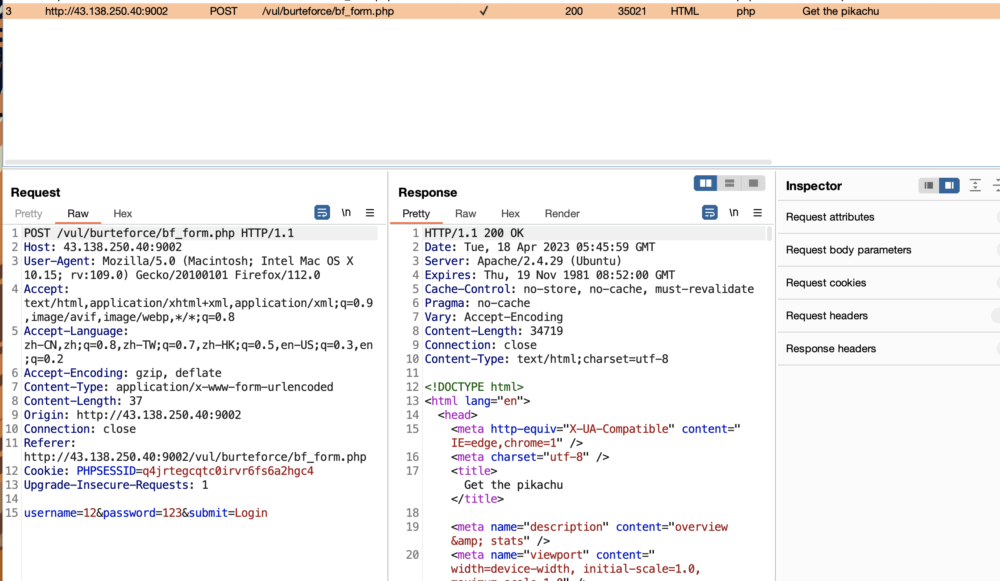
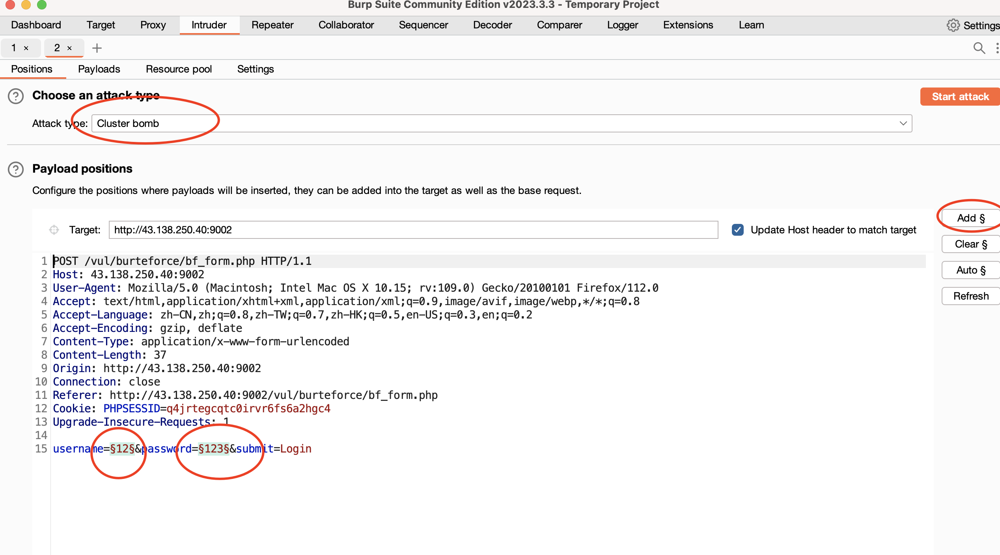
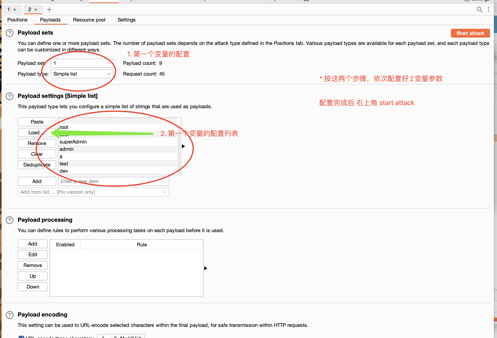
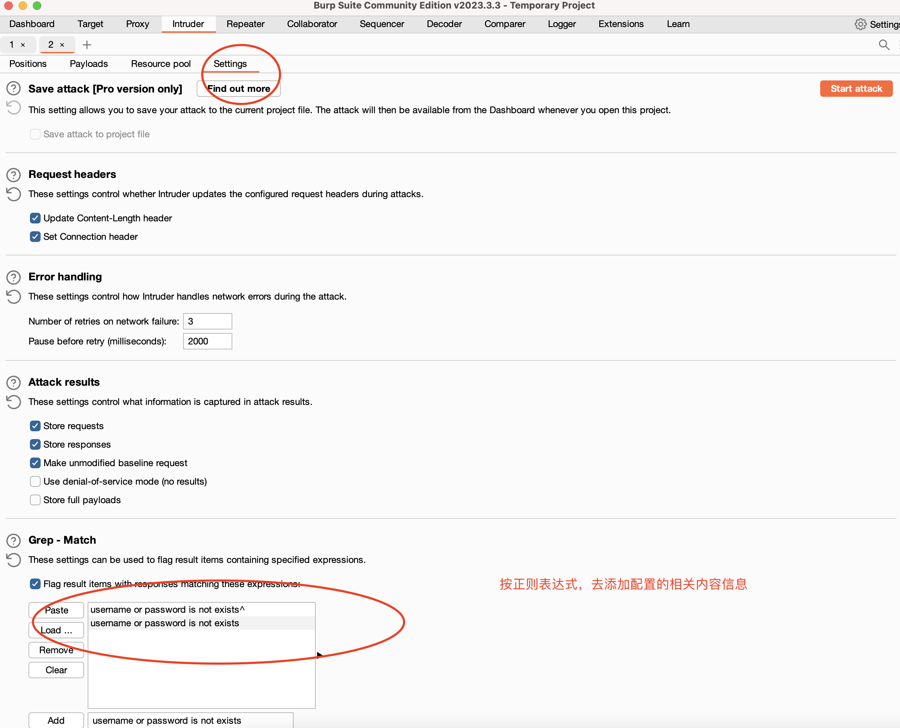
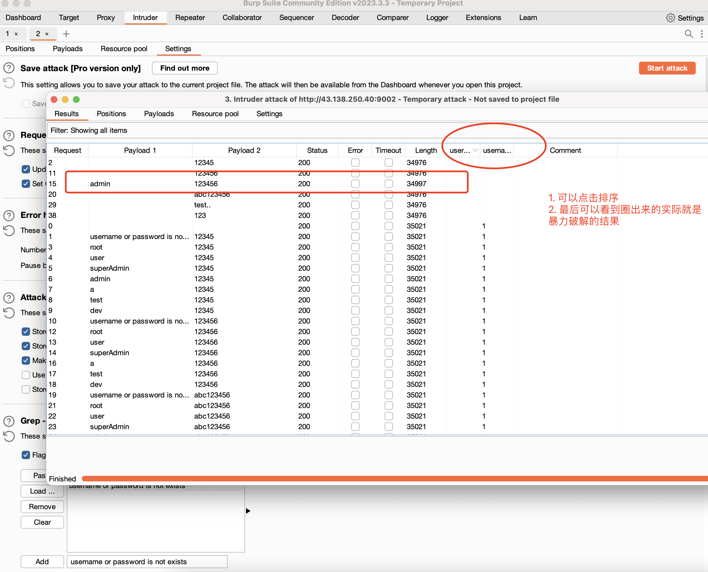

# 暴力破解账号密码

对于密码强度不高的项目，且没有验证码的项目，可采用暴力破解的方式去攻击获取到密码

## 步骤
- 第一步使用burp-suite 抓包工具抓到相应的接口，并使用火狐浏览器配置好相关代理
 

- 第二步 选中抓到的请求 右键 send to intruder，并且做好配置

- 配置的话，可以考虑使用事先准备好的 user.txt password.txt 

- 如何看到是否成功匹配

**参考**
- https://github.com/shadowabi/S-BlastingDictionary
- https://github.com/zhuifengshaonianhanlu/pikachu